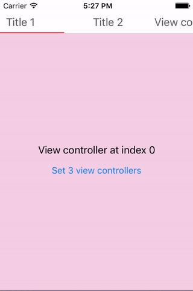
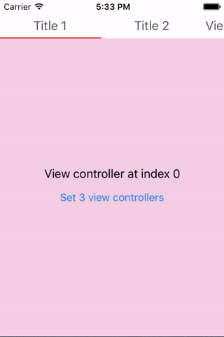
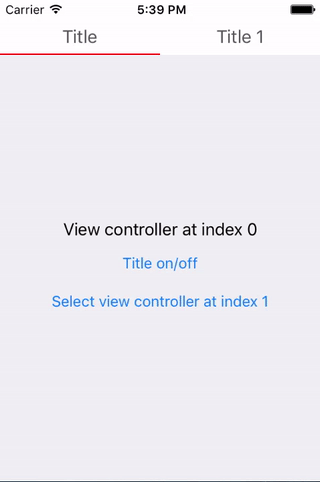
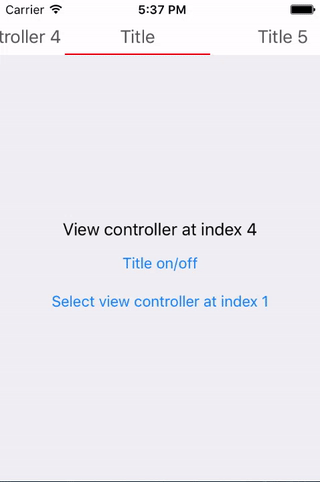
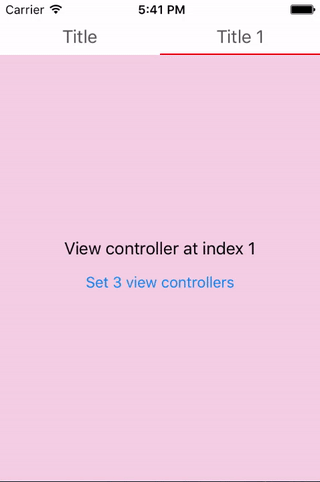

# SWScrollViewController

A container view controller with scroll view. It changes content view controller with scroll view or programmatically.

## Major features

### Select content view controller with title button




### Select content view controller with panning gesture



### Select content view controller programmatically





### Set content view controllers



### Hide or show titles


## How to use

### Install
```
#import "SWScrollViewController.h"
```


### Initialize

```
SWScrollViewController *scrollVC = [[SWScrollViewController alloc] initWithControllers:@[controller, controller2]];
```
    
    
### Change child view controllers

```
scrollVC.viewControllers = @[controller, controller2, controller3];
```
    
### Get title scroll view displaying title buttons and mark line

```
UIScrollView *titleScrollView = scrollVC.titleScrollView;
// Do something to the title scroll view
```
    
### Hide or show titles

It will change content view frame, not just set hidden property of title scroll view

```
// Hide titles
[scrollVC hideTitleScrollView:YES];
// Show titles
[scrollVC hideTitleScrollView:NO];
```
    
### Get content scroll view displaying views of child view controllers

```
UIScrollView *contentScrollView = scrollVC.contentScrollView;
// Do something to the content scroll view
```
    
### Get content view controller whose view is in visible rect

```
UIViewController *contentVC = scrollVC.contentViewController;
```
    
### Get content view which is the view of the selected child view controller

```
UIView *contentView = scrollVC.contentView;
```
    
### Get selected index indicating the selected child view controller (content view controller)

```
NSUInteger selectedIndex = scrollVC.selectedIndex;
```
 
### Set selected index to change content view controller

```
scrollVC.selectedIndex = anIndex;
```
 
### Get scroll view controller of child view controller

```
SWScrollViewController *scrollVC = controller.scrollViewController;
```
